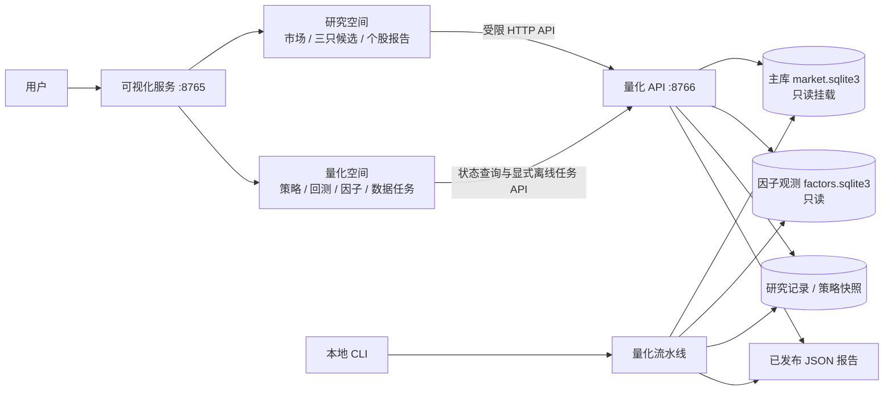
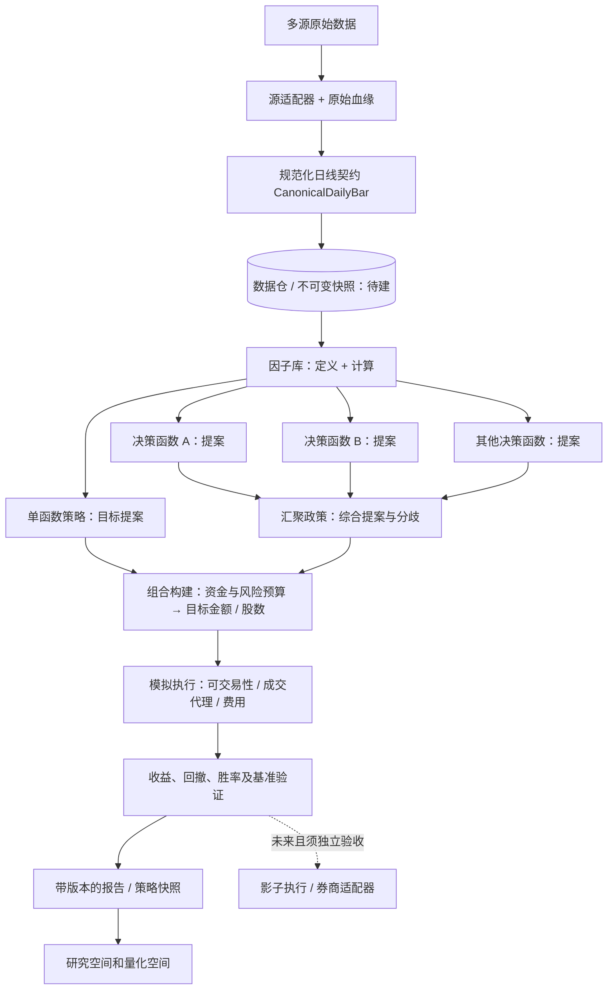

# 研究空间与量化空间：系统边界和演进契约

本文对应 2026-09-29 的本地代码与产物。系统当前服务于人工投资决策，量化研究产生证据，研究空间负责解释和呈现。自动委托、券商连接和无人值守交易尚未实现。

目标决策链见[决策链与预算契约](decision-pipeline.md)：数据加工为因子，多个决策函数分别提案，汇聚政策与组合预算共同决定买卖和规模，再进入模拟执行和评估。当前代码仅实现其中一部分。

## 四层主架构

```mermaid
flowchart BT
    C[1 数据采集层<br/>东方财富 / 腾讯 / 申万 / BaoStock / Qlib] --> S[2 数据存储层<br/>主库 / 历史归档 / 发布文件 / 血缘]
    S --> E[3 实验系统<br/>因子库 + 策略库 → 离线策略引擎 → 回测引擎 → 优化器 → 实验记录器]
    E --> A[4 应用层<br/>研究系统 | 量化系统]
    A -->|逐例人工反馈| F[反馈与复盘库]
    F --> E
    E -.独立验收后扩展.-> O[在线策略与执行：待建]
```

四层只允许沿明确契约传数据。**采集层**保留原始响应、单位、来源与节奏；**存储层**负责规范化、版本和读取，不把新下载的历史价格假装成过去当时已知；**实验系统**使用冻结输入运行因子、策略、回测和参数搜索，归档每次设定与结果；**应用层**从结果生成市场解读、候选、个股报告和控制台。用户回执属于应用与实验之间的桥：它必须先关联已保存的报告，再进入复盘，不能反向修改原实验。

当前离线实验可运行，在线策略、账户/组合风控与执行仍为未来扩展。因子定义、计算和[同一份因子观测存储](shared-factor-store.md)由两套空间共用：分析侧解释个股变化，量化侧在点时校验后供决策函数和预算使用。策略库是量化实验的版本化输入，实验记录池是其输出；反馈/复盘库由应用收集、由实验系统在结果成熟时评估。页面不持有策略计算或数据库写入逻辑。

## 两个空间，一条窄桥



可视化服务只提供页面并代理明确允许的 API；不直接读写行情库。量化 API 查询主库时使用只读连接；成功的个股查询另写入本地研究记录。控制台可按用户的明确请求启动离线参数优化和已到期回执复盘；两种动作返回任务 ID，任务接收/终态事件保存在本地 `task-runs`。同步、主研究运行与历史回补仍由 CLI/独立本地任务执行。这里的任务执行器只服务于当前单量化 API 进程，不是跨进程队列或自动交易服务。

## 当前能力和下一道边界

| 层 | 当前已实现 | 仍需建设 |
| --- | --- | --- |
| 数据来源与规范化 | 东方财富/腾讯/申万日线同步，BaoStock 历史原始归档，Qlib 复权文件检验；`CanonicalDailyBar` 与主库、BaoStock 归档的只读流式适配器 | 将规范化面板接入主研究流水线；历史时点首次可得时间、公司行动、跨源对账与不可变数据快照 |
| 数据库 | SQLite 主库保存标的、日线、同步任务、候选与人工回执；独立历史原始归档；Qlib 文件按发布版本校验 | 统一的点时数据仓、历史股票池与交易状态、面向大规模计算的存储实现 |
| 因子库 | `factor_library.py` 注册 SMA、动量、Z 分数；`daily_factors_v2.py` 注册日线候选；`factor_store.py` 追加因子值、版本、参数、输入快照及可得时间，供分析和量化分别读取；主库日线可手动物化为回顾性因子 | 真正点时合格的源快照和首次发布时间、缺口依赖图、跨版本复算验证、Qlib 适配器 |
| 策略库 | `strategy_catalog.py` 注册三个已实现策略与参数、因子依赖；`strategy_registry.py` 追加完整研究快照并核对 SHA-256 | 冻结的策略定义版本、参数审批/晋级流程、跨版本同条件比较和独立样本外绩效登记 |
| 算法组件库 | 将预测基线和通用时序模型登记为候选信号组件，保存版本、适配状态、已核验实验 ID 与策略关联 | 将模型输出映射成点时可得信号、目标仓位和风险规则，再按同池同成本回测和验证 |
| 策略与回测引擎 | `research.py` 编排特征与目标权重；`backtest.py` 的通用入口消费日期化目标仓位，`paper_execution.py` 消费目标、账户和原价模拟订单；`optimizer.py` 在训练段选参数、在后段作历史留出检查并归档全部候选 | 历史当时股票池、交易流水、可交易性、真实费用、T+1、组合级风险及严格时间外验证 |
| 决策与风控 | 个股参考规则、筛选门槛、数据不足时阻断三只候选；单/多策略日期化目标、同输入汇聚、总仓位和单股上限；人工回执与到期价格复盘 | 组合波动、相关性与回撤约束，异常停机、影子订单和券商接口 |

“已实现策略”表示代码可计算；“有回测快照”表示真实运行过；“经验证可交易”需要独立样本外、可交易性和风险门槛，当前没有达到。控制台分别显示这些状态，不把未运行策略填上收益，也不把三股试验推断为全市场有效。

## 算法组件如何进入策略

TimesFM、Chronos、TFT、Moirai、Tiny Time Mixers、Time-MoE、Timer 等首先是预测或特征算法。算法组件库把它们放在策略管理空间，逐项记录模型版本、是否有本地适配器、是否完成了本系统实验，以及可核验的实验和稳定性记录 ID。登记本身不产生买卖信号；没有真实运行记录的算法只能标为候选，不能继承其他模型的回测分数。

完整交易策略还需要固定如下契约：**当时可得的数据 → 算法输出 → 信号阈值 → 目标仓位 → 风控与退出 → 扣成本回测 → 独立验证**。只有这些步骤定义且绑定策略版本后，算法组件才可在 `strategy_ids` 中关联一条可计算策略。当前已有的 TimesFM 2.5 与 Chronos-Bolt tiny 预测实验也尚未完成这条映射，不能写成已验证可交易策略；它们的预测误差和稳定性仍可从算法组件追溯。

## 数据契约与依赖方向



图中的 `数据仓 / 不可变快照` 是目标边界，当前主流程直接读 `MarketStore`，尚未经过 `CanonicalDailyBar`。规范化契约已经可用于只读检查和构造同口径收盘价面板，不能据此宣称主库完成迁移。

`CanonicalDailyBar` 固定标的、日期、OHLC、`price_basis`、标准股数和人民币成交额，同时保存源端原值及单位、来源 ID、运行 ID、响应哈希、抓取时间和可得的交易/ST 状态。`build_close_panel` 拒绝混用原价、前复权价和指数点位，产出输入指纹。BaoStock 适配器仅在日线与状态的日期、运行及哈希匹配时联接；Qlib 的复权因子与原价单位尚未核验，不能转换成原价或混入同一个收盘面板。当前缺上游首次发布时间，历史点时资格不能仅由 `observed_at` 推断。

因子只依赖信号时点可得、同口径的数据；单函数策略或多个函数汇聚后的策略都输出日期化目标仓位；多函数模式须先综合所有提案与分歧。组合层再按资金和风险预算决定金额与股数。当前三套策略仍在实现内直接计算因子并返回权重；新增的汇聚接口和独立多函数模拟池已运行于研究模式，尚无未来样本，也未通过组合风控验收。回测消费固定的策略版本、股票池、预算、输入指纹、成本和执行假设，不应直接抓远端行情。报告与界面只读取结构化结果，不参与信号计算。此依赖方向使未来替换 SQLite 或接入新来源时，不必改写策略公式。

## 存储与可重现性

| 产物 | 当前写入方式 | 能证明什么 / 不能证明什么 |
| --- | --- | --- |
| `data/quant/market.sqlite3` | `daily_bars` 按标的、交易日、复权口径 upsert；每行含来源、抓取批次、哈希 | 可查当前入库值与来源；历史价格可能被重写，不能还原过去某日当时可见的整库 |
| `data/quant/factors.sqlite3` | `factor-build` 显式计算并只追加因子观测；分析和量化读取同一表 | 可追溯版本、参数、单位、输入指纹和可得证据；当前主库历史数据只产生回顾性观测，不能当点时量化输入 |
| 历史原始归档 SQLite | 分段、低频回补，单独发布状态检查点 | 可看累计原始日线范围；目前不自动进入主策略回测或荐股 |
| Qlib 发布文件 | 发布版本与文件哈希检验 | 可作独立复权研究资料；不是当前策略股票池或已核验的成交原价 |
| `reports/quant/latest` | 每次研究运行覆盖最新 JSON/Markdown，并以 `run_id` 关联 | 适合当前页面；`latest` 不是历史策略库 |
| `reports/quant/strategy-runs` | 每次研究完整快照追加，读取时校验内容 SHA-256 | 保存参数、曲线、指标、输入指纹与来源运行；输入指纹不能替代尚未建成的不可变数据快照 |
| `reports/quant/optimizations` | 每次参数搜索追加完整候选、训练选择及历史留出结果；读取时复核哈希和评分规则 | 可追踪何时按什么目标选中参数；留出检验仍非独立前瞻证据 |
| `reports/quant/research-journal` | 成功个股查询追加私有记录，含完整报告和 SHA-256 | 可复核用户看到的当次结论和版本；记录本身不是交易回执 |
| `reports/quant/feedback-cases` / `case-reviews` | 人工回执与逐例复盘分别追加，API 仅返回不含成交价、数量和备注的摘要 | 可关联具体报告与后续结果；已记录和已成熟数量以控制台实时状态为准 |
| `reports/quant/task-runs` | 离线任务接受与终态事件追加，重启后从事件恢复最近状态 | 可看任务是否完成或中断；任务事件不代替实验、优化或复盘产物 |

量化空间的**实验记录池**以 `strategy-runs` 的每份已校验快照为单位，展示实验设定、数据日期、指标与验证状态。策略库按策略 ID/版本聚合；同一策略可以有多次实验，不能只保留最新一次结果。**复盘库**则从用户逐例回执开始：回执必须关联一份已保存的个股研究记录，保存观察/跳过/买卖决定、决定日期及用户自愿填写的实际成交信息。当前个股研究记录与用户回执是两类对象，查询一次股票不能自动算作用户已行动。到期结果与策略优化须按 case 关联，区分信号后的价格走势和真实成交收益。

当前单策略适配器把日终信号交给不依赖策略实现的回测核心，在下一交易日**收盘价代理成交**，默认单一成本率，展示累计收益、年化收益、波动、无风险利率为零的夏普、最大回撤和累计换手；同时列同池等权持有和沪深 300 价格指数参考。当前展示的三股结果来自事后选定股票池，前后段是回看诊断，独立前瞻样本外仍待积累。日线回测无法证明次日 10:30 的实际成交，也未覆盖停牌、涨跌停、分项费用和全部黑天鹅风险。

`north_star.py` 定义 0–10 分、保留一位小数的**历史回测优化目标**：相对同池等权买入持有，年化收益改善与最大回撤改善各占 50%，基线固定为 5.0。它用于对比实验，不是上涨概率、未来收益预测或晋级自动交易的门槛。参数搜索即使使用历史留出段，也必须明确训练段负责选择，留出段只检验；二者均不能冒充独立前瞻验证。

`optimizer.py` 当前有固定、可审计的小参数网格。每个候选只用训练段计分，按事先固定的分数/回撤/网格顺序决出参数，再在后面的历史留出段评估；归档含候选列表、输入指纹、规则版本、训练与留出指标及不可晋级原因。股票池仍是事后选定，历史价格可修订，因此留出段状态标为 `retrospective_holdout_only`。未来新增参数只能生成新的实验和版本，不能回写旧实验以抬高表现。

## 可靠性推进顺序

1. **锁定输入**：将规范化适配器接进研究流水线，建立不可变数据快照、历史股票池和公开时间字段；保留数据覆盖、缺失、价格口径与来源对账结果。
2. **锁定计算**：因子值按定义版本、参数、输入快照和日期保存；策略定义与运行结果分开，任何策略变更生成新版本。回测从不可变输入重算，保存权益曲线、交易流水、费用和基准。
3. **锁定评价**：先做时序外和跨市场环境检验，再做候选发布门槛与组合风控；记录失败样本、不可成交样本和参数选择过程。用户回执与实际成交价另存，信号收益和个人账户收益分开复盘。
4. **再接执行**：只有影子运行、账户约束、异常停机和独立风控验收完成后，才考虑券商沙盒与受控下单。研究空间和量化空间继续消费同一份可追溯结果，执行适配器不能绕过风控层。

开发时用 `scripts/start-local-dev.py` 一条命令启动本地量化 API、可视化桥接和前端热更新；`compose.quant-dashboard.yaml` 保留为可选的容器部署。回补和同步仍由量化 CLI 显式执行；网页控制台可显式触发一次离线参数优化或到期回执复盘，并读取持久任务状态。优化仅用已入库日线，结果不自动晋级策略；复盘不补行情，更不发交易指令。
